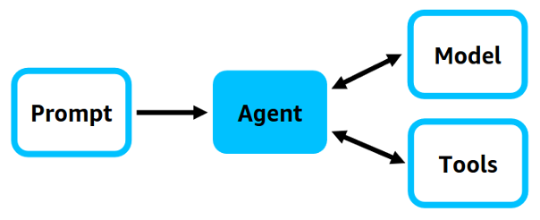

# agent_strands_workshop


This workshop includes step by step instructions to accompany the workshop 'AI Agents in Action: Build Cloud-Ready AI with AWS Strands' for AWS Melbourne User Group


- Initializing a basic python structure
- Explore design stands agents using workflow, multi-agent and MCP patterns
- Deploying the agent to AWS using SAM


---

## Table of Contents

0. [Prerequisites](#prerequisites)
1. [Step 1: Initialize the Project](#step-1-initialize-the-project)
2. [Step 2: Create first strands Agent](#step-2-create-first-strands-agent)
3. [Step 3: Create strands agent using word_count tool](#step-3-strands-agent-using-word-count)
4. [Step 4: Create MCP strands agent integrated with AWS](#step-4-create-mcp-strands-agent-integrated-with-aws)
5. [Step 5: Multi-agent Strands Design](#step-5-multi-agent-strands-design)
6. [Step 6: Workflow Strands Design](#step-6-workflow-strands-design)


---

## Prerequisites


Before starting, ensure you have the following installed:

- **Node.js** (>= 14.x)
- **AWS CLI** (configures upon authorization)
- **AWS SAM** (>= 2.x)
- **Python**  (>= 3.x)
- **Claude Bedrock Model enabled**  (= 3.5)

---

## Step 1: Initialize the Project

Create the .venv environment

```
python3 -m venv .venv
```

Activates the Python virtual environment located in the .venv directory.

```
source .venv/bin/activate 
```

Install dependencies for this workshop

```
pip install openai fastapi uvicorn strands-agents strands-agents-tools "strands-agents[a2a]" mcp
```

## Step 2: Create first strands Agent



Create a file called 'my_agent.py'

In root run:

```
touch my_agent.py
```

Inside my_agent.py paste the following code block

````
from strands import Agent, tool
from strands.models import BedrockModel
from strands_tools import http_request

# System prompt
COUNTRY_INFO_SYSTEM_PROMPT = """You are a geography assistant with HTTP capabilities. You can:

1. Make HTTP requests to public APIs or Wikipedia to gather country information
2. Provide the capital city and a short description of the country
3. Use the word_count tool to count how many words are in your full response

To gather information:
- Use this format: https://en.wikipedia.org/api/rest_v1/page/summary/{country_name}
- Replace spaces with underscores (e.g., "New Zealand" → "New_Zealand")
- If the response is a disambiguation page, try with "{country_name} (country)"

When responding:
- Clearly state the capital city
- Include a concise, human-friendly description of the country
- End with the total word count of your full response
- Handle errors gracefully if the country is not found or response is ambiguous
"""

# Tool: count words
@tool
def word_count(text: str) -> int:
    return len(text.split())

# Bedrock model config
bedrock_model = BedrockModel(
    model_id="us.anthropic.claude-3-5-haiku-20241022-v1:0",
    temperature=0.3,
)

# Agent setup
agent = Agent(
    name="GeoAgent",
    description="Finds country info and counts words using Wikipedia",
    model=bedrock_model,
    tools=[http_request, word_count],
    system_prompt=COUNTRY_INFO_SYSTEM_PROMPT,
)

# Ask the agent from CLI
if __name__ == "__main__":
    while True:
        prompt = input("Ask about a country: ")
        if prompt.lower() in {"exit", "quit"}:
            break
        response = agent(prompt)
        print("Response:", response)

````

Test the code by running

```
python3 my_agent.py
```

## Step 3: Create strands agent using word_count tool

Create word_count_agent.py file

```
touch word_count_agent.py
```

Paste the following code block into word_count_agent.py

```
from fastapi import FastAPI
from pydantic import BaseModel
from strands import Agent, tool
from strands.models import BedrockModel
from strands_tools import http_request

# System prompt: guides agent behavior
COUNTRY_INFO_SYSTEM_PROMPT = """You are a geography assistant with HTTP capabilities. You can:

1. Make HTTP requests to public APIs or Wikipedia to gather country information
2. Provide the capital city and a short description of the country
3. Use the word_count tool to count how many words are in your full response

To gather information:
- Use this format: https://en.wikipedia.org/api/rest_v1/page/summary/{country_name}
- Replace spaces with underscores (e.g., "New Zealand" → "New_Zealand")
- If the response is a disambiguation page, try with "{country_name} (country)"

When responding:
- Clearly state the capital city
- Include a concise, human-friendly description of the country
- End with the total word count of your full response
- Handle errors gracefully if the country is not found or response is ambiguous
"""

# Custom tool: count words in final response
@tool
def word_count(text: str) -> int:
    """Count words in the given text."""
    return len(text.split())

# Model configuration: Bedrock Claude 3.5 Haiku
bedrock_model = BedrockModel(
    model_id="us.anthropic.claude-3-5-haiku-20241022-v1:0",
    temperature=0.3,
)

# AI Agent setup
agent = Agent(
    name="GeoAgent",
    description="Finds country info and counts words using Wikipedia",
    model=bedrock_model,
    tools=[http_request, word_count],
    system_prompt=COUNTRY_INFO_SYSTEM_PROMPT,
)

# FastAPI app setup
app = FastAPI(title="Strands GeoAgent")

# Request schema
class PromptRequest(BaseModel):
    prompt: str

# POST endpoint to run the agent
@app.post("/ask")
async def ask_agent(request: PromptRequest):
    try:
        response = agent(request.prompt)
        return {"response": str(response)}
    except Exception as e:
        return {"error": str(e)}

````

Run the server on port 8000

```
uvicorn word_count_agent:app --reload --port 8000

````

Test the agent by making an api calling using prompt (example prompt below).

In a new terminal

```
curl -X POST http://127.0.0.1:8000/ask \
  -H "Content-Type: application/json" \
  -d '{"prompt": "Tell me about New Zealand"}'

````


## Step 4: Create MCP strands agent integrated with AWS 

Create a file called 'mcp_docs.py'

```
touch mcp_docs.py
````

Paste in the following code:

```
from mcp import StdioServerParameters, stdio_client
from strands import Agent
from strands.models import BedrockModel
from strands.tools.mcp import MCPClient

aws_docs_client = MCPClient(
    lambda: stdio_client(
        StdioServerParameters(
            command="uvx", args=["awslabs.aws-documentation-mcp-server@latest"]
        )
    )
)

aws_diag_client = MCPClient(
    lambda: stdio_client(
        StdioServerParameters(
            command="uvx", args=["awslabs.aws-diagram-mcp-server@latest"]
        )
    )
)


bedrock_model = BedrockModel(
    model_id="us.anthropic.claude-3-5-haiku-20241022-v1:0",
    temperature=0.7,
)

SYSTEM_PROMPT = """
You are an expert AWS Certified Solutions Architect. Your role is to help customers understand best practices on building on AWS. You can querying the AWS Documentation and generate diagrams. Make sure to tell the customer the full file path of the diagram.
"""

with aws_diag_client, aws_docs_client:
    all_tools = aws_diag_client.list_tools_sync() + aws_docs_client.list_tools_sync()
    agent = Agent(tools=all_tools, model=bedrock_model, system_prompt=SYSTEM_PROMPT)

    response = agent(
        "Get the documentation for AWS Lambda then create a diagram of a website that uses AWS Lambda for a static website hosted on S3"
    )

````

Test the agent

```
python3 mcp_docs.py

````


## Step 5: Multi-agent Strands Design (sequence)


Create a new file called 'multi-agent.py'

```
touch multi_agent.py

````

In that file, post the following code block:

```
from fastapi import FastAPI
from pydantic import BaseModel
from strands import Agent, tool
from strands.models import BedrockModel
from strands_tools import http_request

# ------------------ System Prompts ------------------

# 🌍 GeoAgent system prompt
COUNTRY_INFO_SYSTEM_PROMPT = """You are a geography assistant with HTTP capabilities. You can:

1. Make HTTP requests to public APIs or Wikipedia to gather country information
2. Provide the capital city and a short description of the country
3. Use the word_count tool to count how many words are in your full response

To gather information:
- Use this format: https://en.wikipedia.org/api/rest_v1/page/summary/{country_name}
- Replace spaces with underscores (e.g., "New Zealand" → "New_Zealand")
- If the response is a disambiguation page, try with "{country_name} (country)"

When responding:
- Clearly state the capital city
- Include a concise, human-friendly description of the country
- End with the total word count of your full response
- Handle errors gracefully if the country is not found or response is ambiguous
"""

# 💱 CurrencyAgent system prompt
CURRENCY_CONVERT_SYSTEM_PROMPT = """You are a currency converter assistant.

1. You convert New Zealand Dollars (NZD) into the currency of a given country.
2. Use this exchange rate API endpoint format:
   https://api.exchangerate.host/convert?from=NZD&to={currency_code}
3. Return only the conversion result in your reply.

You must look up the correct 3-letter currency code for the country requested. If the country is ambiguous or not supported, say so clearly.
"""

# ------------------ Tools ------------------

@tool
def word_count(text: str) -> int:
    """Count words in the given text."""
    return len(text.split())

# ------------------ Model ------------------

bedrock_model = BedrockModel(
    model_id="us.anthropic.claude-3-5-haiku-20241022-v1:0",
    temperature=0.3,
)

# ------------------ Agents ------------------

geo_agent = Agent(
    name="GeoAgent",
    description="Finds country info and counts words using Wikipedia",
    model=bedrock_model,
    tools=[http_request, word_count],
    system_prompt=COUNTRY_INFO_SYSTEM_PROMPT,
)

currency_agent = Agent(
    name="CurrencyAgent",
    description="Converts NZD to another country's currency",
    model=bedrock_model,
    tools=[http_request],
    system_prompt=CURRENCY_CONVERT_SYSTEM_PROMPT,
)

# ------------------ Orchestrator ------------------

def orchestrator(prompt: str):
    prompt_lower = prompt.lower()
    if "convert" in prompt_lower or "nzd" in prompt_lower or "currency" in prompt_lower:
        return currency_agent(prompt)
    else:
        return geo_agent(prompt)

# ------------------ FastAPI App ------------------

app = FastAPI(title="Strands Orchestrator MCP")

class PromptRequest(BaseModel):
    prompt: str

@app.post("/ask")
async def ask_mcp(request: PromptRequest):
    try:
        response = orchestrator(request.prompt)
        return {"response": str(response)}
    except Exception as e:
        return {"error": str(e)}


```

Run the server on port 8001

```
uvicorn multi_agent:app --reload --port 8001

```

Test the agent by runnning in a new terminal

```

curl -X POST http://127.0.0.1:8001/ask \
  -H "Content-Type: application/json" \
  -d '{"prompt": "Convert 100 New Zealand dollars to Japanese Yen"}'

curl -X POST http://127.0.0.1:8001/ask \
  -H "Content-Type: application/json" \
  -d '{"prompt": "Tell me about New Zealand"}'


  ````

## Step 6: Workflow Strands Design (Supervisor)


Create a new file called 'workflow_agent.py'

``` 
touch workflow_agent.py

```

In that file, paste the following code block

```

import logging
from fastapi import FastAPI
from pydantic import BaseModel
from strands import Agent, tool
from strands.models import BedrockModel
from strands_tools import http_request

# ------------------ Setup logging ------------------

logging.basicConfig(
    level=logging.INFO,
    format="%(asctime)s %(levelname)s %(name)s - %(message)s",
)
logger = logging.getLogger("holiday_workflow")

# ------------------ System Prompts ------------------

# Agent 1: Find a holiday destination based on user preferences
HOLIDAY_DESTINATION_PROMPT = """You are an expert travel assistant.

Given this user input, recommend a single ideal holiday destination (city and country).
Be concise and clear.
"""

# Agent 2: Create an itinerary for the holiday destination
ITINERARY_PROMPT = """You are a travel planner assistant.

Given a holiday destination, create a detailed 5-day itinerary for a tourist visiting this location.
Include key activities, places to visit, and tips.
"""

# Agent 3: Create a budget for the holiday
BUDGET_PROMPT = """You are a budget planning assistant.

Given a 5-day holiday itinerary for a destination, create a detailed budget estimate including accommodation, food, transport, and activities.
Provide costs in USD.
"""

# ------------------ Tools ------------------

@tool
def word_count(text: str) -> int:
    return len(text.split())

# ------------------ Model ------------------

bedrock_model = BedrockModel(
    model_id="us.anthropic.claude-3-5-haiku-20241022-v1:0",
    temperature=0.3,
)

# ------------------ Agents ------------------

agent_1 = Agent(
    name="HolidayDestinationAgent",
    description="Finds an ideal holiday destination from user input",
    model=bedrock_model,
    system_prompt=HOLIDAY_DESTINATION_PROMPT,
)

agent_2 = Agent(
    name="ItineraryAgent",
    description="Creates a 5-day itinerary for a given holiday destination",
    model=bedrock_model,
    system_prompt=ITINERARY_PROMPT,
)

agent_3 = Agent(
    name="BudgetAgent",
    description="Creates a budget estimate for a 5-day holiday itinerary",
    model=bedrock_model,
    system_prompt=BUDGET_PROMPT,
)

# ------------------ Workflow Orchestrator ------------------

def orchestrator(user_input: str):
    logger.info(f"Workflow started with input: {user_input}")

    # Step 1: Find holiday destination
    prompt_1 = f"{user_input}\nPlease recommend a single holiday destination."
    destination = agent_1(prompt_1)
    logger.info(f"Agent 1 found destination: {destination}")

    # Step 2: Create itinerary for destination
    prompt_2 = f"Destination: {destination}\nPlease create a 5-day itinerary."
    itinerary = agent_2(prompt_2)
    logger.info(f"Agent 2 created itinerary:\n{itinerary}")

    # Step 3: Create budget for itinerary
    prompt_3 = f"Itinerary:\n{itinerary}\nPlease create a budget for a 5-day holiday."
    budget = agent_3(prompt_3)
    logger.info(f"Agent 3 created budget:\n{budget}")

    # Combine all outputs
    final_response = (
        f"Holiday Destination:\n{destination}\n\n"
        f"5-Day Itinerary:\n{itinerary}\n\n"
        f"Budget Estimate:\n{budget}"
    )

    logger.info("Workflow completed successfully")
    return final_response

# ------------------ FastAPI App ------------------

app = FastAPI(title="Holiday Planning Workflow MCP")

class PromptRequest(BaseModel):
    prompt: str

@app.post("/ask")
async def ask_mcp(request: PromptRequest):
    logger.info(f"Received request with prompt: {request.prompt}")
    try:
        response = orchestrator(request.prompt)
        logger.info("Request processed successfully")
        return {"response": response}
    except Exception as e:
        logger.error(f"Error processing request: {e}", exc_info=True)
        return {"error": str(e)}

```

Run the server on port 8002

```
uvicorn workflow_agent:app --reload --port 8002
```

In a new terminal, run

```

curl -X POST http://127.0.0.1:8002/ask \
  -H "Content-Type: application/json" \
  -d '{"prompt": "I want a relaxing beach holiday with cultural experiences."}'

```


To deploy:

cd into Deploy

```
cd Deploy
```

Build and deploy SAM template

```
sam build && sam deploy --guided 
```

Select us-east-1

Test by running

```
curl -s -X POST "<API>" \
  -H "Content-Type: application/json" \
  -d '{"prompt": "Plan a relaxing beach vacation in Australia for a family of four"}' \
  | jq -r '.response'


```